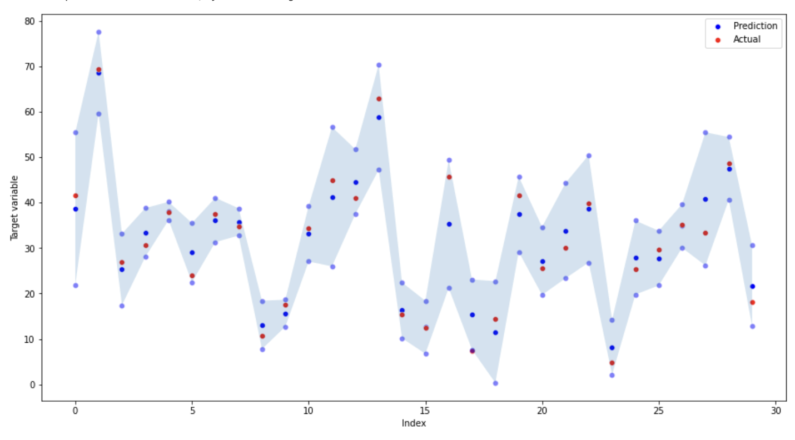
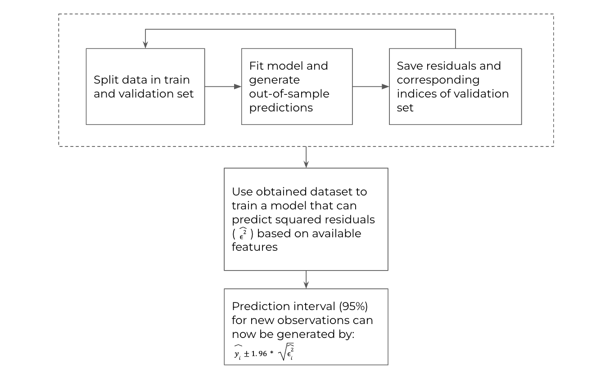

### Introduction

Using prediction intervals is a widely applied method to quantify uncertainty of model predictions in regression problems. At the same time, methods like gradient boosting have become very popular ways to tackle regression problems in tabular datasets. These types of models do not have a standard way to quantify uncertainty of predictions, unlike for example linear regression or Bayesian models. Quantile regression can be used to build a prediction interval when using tree-based algorithms. However, if this option is not readily available it can be tricky to implement, as it requires altering the loss function of algorithm.

The method described in this repository, referred to as the **distribution estimator**, is a straightforward and generic way to generate accurate prediction interval and can be combined with any machine learning model of choice. The distribution estimator depends on the assumption that the realizations of some continuous target variable are normally distributed around the predictions of some regression model. Moreover, it also assumes that the standard deviation of this distribution can be estimated based on the features available in the data. 

This repository contains an explanation of the estimation process, and [a Jupyter notebook](Example.ipynb) that demonstrates implementation in Python. 

### Algorithm

Our prediction interval will be build by two models: one main model that is generating a point prediction and a second model that is used to generate an *approximated standard deviation*. 
We will base our prediction interval on this *approximated standard deviation* and the assumption that the realizations of our target variable are normally distributed around the point predictions of our model. Assuming we have already decided on what our main model is going to look like (algorithm, features to use, hyperparameters), our goal will be to set up the second model.  

First we generate a dataset which we can base our second model on:

* Split the available data in a train and a validation set
* Fit a model based on observations in the train set, use this model to compute a prediction for each observation in the validation set
* Compute the squared residuals for each observation in the validation set. Save these residuals and the indices of the observations corresponding to these residuals

After repeating these steps multiple times, we obtain a dataset that we can use to map the out-of-sample residuals to the features that are available in the data. That is, we can fit a model that can predict the squared residual of new observations based on the features in the data. After training this model, we can use it to generate prediction intervals for new observations:

* Compute the predicted squared residual for each new observation
* Compute the square root of the predicted squared residuals to obtain an *approximated standard deviation* for each new observation
* The 95% prediction interval (estimated distribution) of any new observation is now equal to the predicted value of that observation plus and minus 1.96 times the *approximated standard devation*. Note that the value 1.96 refers to the approximate t-statistic of a normal distribution corresponding to a p-value of 0.05. 

For more information, see the implementation available in [this Jupyter notebook](Example.ipynb). 

### References

* https://www.cs.toronto.edu/~delve/data/boston/bostonDetail.html Boston housing dataset
* https://github.com/stedy/Machine-Learning-with-R-datasets White wine and concrete datasets